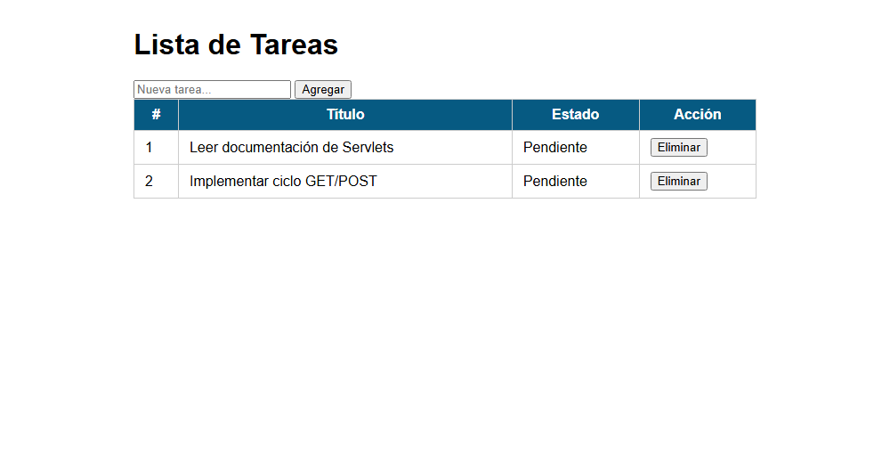
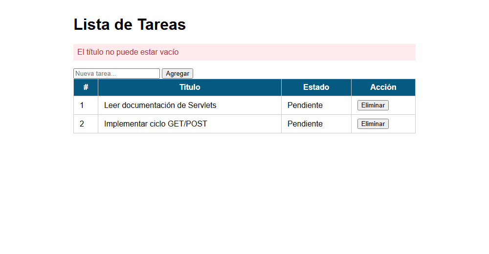
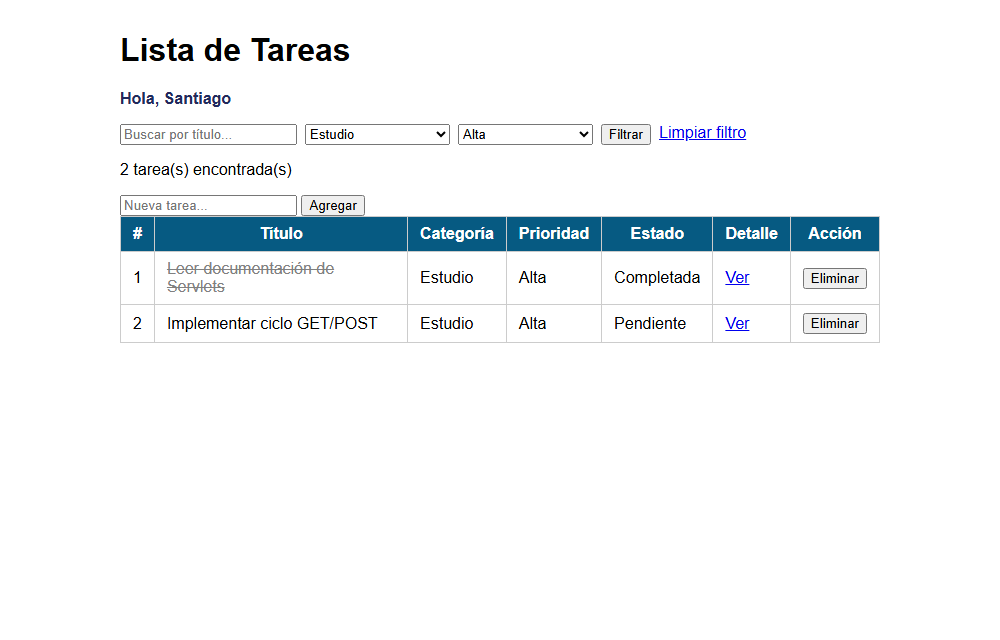
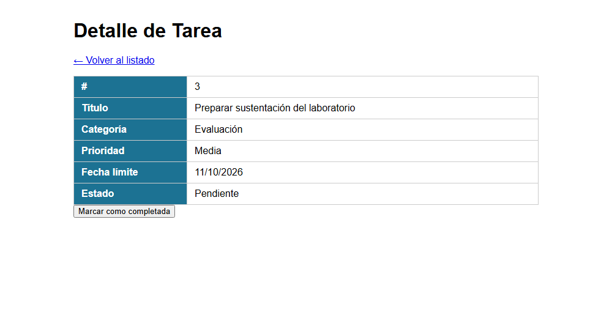

# Post-contenido — Unidad 5: Fundamentos de Java Web (Servlets y JSP)

**Autor:** Santiago Carreño Calceto · Programación Web — Séptimo Semestre

## Descripción
Repositorio del laboratorio de la Unidad 5 de Programación Web.
Un único proyecto Maven Web (`gestion-tareas`) con dos partes que extienden
el mismo dominio de tareas: la Parte 1 construye el Servlet base con el
ciclo GET/POST y el patrón Post/Redirect/Get; la Parte 2 le agrega filtrado
combinado, vista de detalle con un segundo Servlet, y sesión para
personalización y persistencia del filtro.

**Tecnologías:** Java 17 · Jakarta Servlet 6.0 · JSP + EL + JSTL 3.0 · Maven · Apache Tomcat 10.1

## Estructura
```
carreno-post1-u5/
├── pom.xml
├── README.md
├── img/                                   ← capturas de pantalla
└── src/main/
    ├── java/com/ejemplo/
    │   ├── model/Tarea.java
    │   └── servlet/
    │       ├── TareasServlet.java         ← /tareas (GET lista, POST acciones)
    │       └── DetalleTareaServlet.java   ← /tareas/detalle?id=X
    └── webapp/
        ├── css/estilos.css
        ├── index.jsp                      ← redirige a /tareas
        └── WEB-INF/
            ├── web.xml
            └── views/
                ├── tareas.jsp
                └── detalle.jsp
```

## Parte 1 — Servlet de gestión de tareas
`TareasServlet` procesa peticiones GET (listar) y POST (agregar, eliminar),
con validación en el servidor (título vacío → mensaje de error sin agregar
la tarea) y el patrón Post/Redirect/Get para evitar el reenvío de
formularios al recargar la página.

## Parte 2 — Filtros, detalle y sesión
`TareasServlet` se extiende con filtrado combinado por texto, categoría y
prioridad, y con las acciones `completar` e `identificar`. Se agrega
`DetalleTareaServlet`, que lee la misma lista de tareas desde
`applicationScope` y hace forward a una vista de detalle con la fecha
límite formateada. `HttpSession` guarda el nombre del usuario identificado
y el último filtro aplicado.

| Ruta | Método | Qué hace |
|---|---|---|
| `/tareas` | GET | Lista; acepta `q`, `cat`, `prioridad` (combinables). Sin parámetros, restaura el último filtro de la sesión |
| `/tareas` | POST `accion=agregar` | Agrega una tarea (valida título) → redirect |
| `/tareas` | POST `accion=eliminar` | Elimina por id → redirect |
| `/tareas` | POST `accion=completar` | Marca como completada → redirect |
| `/tareas` | POST `accion=identificar` | Guarda el nombre en sesión → redirect |
| `/tareas/detalle?id=X` | GET | Detalle de la tarea (forward a `detalle.jsp`) |

## Decisiones de diseño

**Parte 1**
- **La lista de tareas es una variable de instancia** porque es estado
  compartido de toda la aplicación, no un dato de una petición individual.
  Lo que sí es propio de cada petición (por ejemplo el `titulo` leído en un
  POST) se maneja como variable local del método.
- **Estructuras seguras para concurrencia.** El contenedor crea una sola
  instancia del Servlet y la atiende con varios hilos a la vez. Por eso la
  lista es un `CopyOnWriteArrayList` (muchas lecturas, pocas escrituras) y
  el generador de ids un `AtomicInteger`: un `int contadorId++` no es
  atómico y dos peticiones simultáneas podrían recibir el mismo id.
- **Post/Redirect/Get.** Todo POST exitoso termina en `sendRedirect` a
  `/tareas`; recargar la página repite un GET inofensivo y no el formulario.
  La única excepción es el error de validación, que hace forward para que
  el mensaje (atributo de request) llegue a la vista.
- **Validación en el servidor** además del `required` del HTML, porque una
  petición puede llegar sin pasar por el formulario. Un `id` no numérico
  se ignora en lugar de producir un error 500.

**Parte 2**
- **Filtro y nombre del usuario en `HttpSession`, no en el request**,
  porque deben sobrevivir a varias peticiones distintas (navegación entre
  `/tareas` y `/tareas/detalle`). La lista filtrada, en cambio, sí es de
  request: es el resultado calculado para esa respuesta.
- **`DetalleTareaServlet` lee las tareas desde el `ServletContext`
  (`applicationScope`)** en vez de duplicar la lista: ambos Servlets ven
  exactamente el mismo estado. `TareasServlet` usa `loadOnStartup = 1`
  para publicar la lista al desplegar, de modo que el detalle funciona
  aunque sea la primera URL visitada.
- **Forward en el detalle, no redirect:** solo se entrega un objeto ya
  calculado a una vista. Un redirect perdería el atributo y obligaría a una
  segunda petición; PRG solo se necesita después de un POST.
- **Estilos en `css/estilos.css`** al aparecer una segunda vista
  (`detalle.jsp`), para no duplicar el bloque `<style>` de la Parte 1.
- **Salida escapada con `<c:out>` y `fn:escapeXml()`** en todos los datos
  que escribe el usuario (título, nombre, texto del filtro), para evitar
  XSS. Se usan las URIs de Jakarta Tags 3.0 (`jakarta.tags.core`, etc.),
  las propias de JSTL 3.0 sobre Tomcat 10.

## Cómo compilar y desplegar
Requisitos: JDK 17+, Maven 3.8+, Apache Tomcat 10.1.

1. Clonar el repositorio: `git clone https://github.com/[usuario]/carreno-post1-u5.git`
2. Abrir la carpeta como proyecto Maven en IntelliJ IDEA.
3. Compilar: `mvn clean package` → genera `target/gestion-tareas.war`.
4. Desplegar:
   - **IntelliJ:** Run → Edit Configurations → + → Tomcat Server → Local;
     en *Deployment* agregar el artefacto `gestion-tareas:war exploded` con
     *Application context* `/gestion-tareas`.
   - **Sin IDE:** copiar `target/gestion-tareas.war` a `TOMCAT/webapps/` e
     iniciar Tomcat (`bin/startup.bat` o `bin/startup.sh`).
5. Abrir http://localhost:8080/gestion-tareas/tareas

Ejemplos de URLs para probar:
- Filtro combinado: `/gestion-tareas/tareas?cat=Estudio&prioridad=Alta`
- Búsqueda por texto: `/gestion-tareas/tareas?q=jstl`
- Detalle: `/gestion-tareas/tareas/detalle?id=3`

## Capturas de pantalla

**Parte 1 — Lista inicial y validación**




**Parte 2 — Filtro combinado y detalle**



